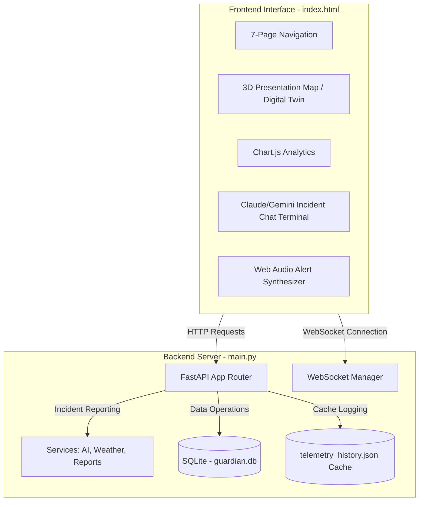

# Project Summary: Guardian Mesh Environmental Ground Station

Guardian Mesh is a professional, offline-resilient environmental monitoring ground station dashboard. It is designed to coordinate sensor networks in remote areas, provide real-time dashboards, run local AI analyses, and provide simulation features for training and demonstrations.

---

## 1. Executive Summary
Guardian Mesh uses a modern corporate theme featuring Maroon (`#800020`), Black (`#0B0B0D`), and Soft Pink (`#F5C2C9`) highlights. The system is designed to run locally on a Python backend with a SQLite database, providing complete offline capabilities. External APIs (such as NASA FIRMS, AQICN, and Open-Meteo) function as optional enhancements with full local fallbacks.

---

## 2. Technical Architecture & Component Layout



### File Structure
- **[main.py](file:///c:/Users/Vinay%20Singh/Desktop/Far_Away/main.py):** FastAPI application entry point, mounts api routers, configures CORS, serves templates, and manages WebSocket connections.
- **[api/routes.py](file:///c:/Users/Vinay%20Singh/Desktop/Far_Away/api/routes.py):** Implements all REST endpoints for fetching and posting data, managing panic alerts, simulation triggers, and AI reports.
- **[api/websocket.py](file:///c:/Users/Vinay%20Singh/Desktop/Far_Away/api/websocket.py):** WebSocket connection manager for real-time broadcasts.
- **[database/database.py](file:///c:/Users/Vinay%20Singh/Desktop/Far_Away/database/database.py):** SQLite connections and table schema definitions.
- **[database/seed.py](file:///c:/Users/Vinay%20Singh/Desktop/Far_Away/database/seed.py):** Historical telemetry and node configuration seed data generator.
- **[services/](file:///c:/Users/Vinay%20Singh/Desktop/Far_Away/services/):**
  - [ai_service.py](file:///c:/Users/Vinay%20Singh/Desktop/Far_Away/services/ai_service.py): Generates incident reports using Anthropic Claude / Google Gemini (or offline fallback models).
  - [weather_service.py](file:///c:/Users/Vinay%20Singh/Desktop/Far_Away/services/weather_service.py): Fetches live weather, AQI, and NASA FIRMS fire hotspots with mock fallbacks.
  - [report_service.py](file:///c:/Users/Vinay%20Singh/Desktop/Far_Away/services/report_service.py): CSV/PDF telemetry export helpers.
- **[templates/index.html](file:///c:/Users/Vinay%20Singh/Desktop/Far_Away/templates/index.html):** Multi-page modern dashboard with 3D digital twins and configurations.
- **[config/](file:///c:/Users/Vinay%20Singh/Desktop/Far_Away/config/):** Configuration helpers reading API keys and system variables from [config.json](file:///c:/Users/Vinay%20Singh/Desktop/Far_Away/config.json).

---

## 3. Database Schema
Guardian Mesh manages structured data offline using SQLite (`guardian.db`):
- `sensor_data`: Tracks historical metrics (temperature, humidity, pressure, air quality, rainfall, wind speed, battery levels, RSSI, relay paths).
- `nodes`: Dynamic inventory storing each node's status, battery level, RSSI, and overall computed health index.
- `node_config`: Settings for sample rates, broadcast intervals, and custom active sensor flags.
- `panic_alerts`: Log of critical messages (e.g. `🔥 WILDFIRE SIGNATURE`) with active states (`INCOMING`, `ACKNOWLEDGED`, `RESOLVED`).
- `events`: Central ledger for diagnostic logging (packet caching, link toggles, telemetry records).
- `ai_reports`: Automated briefs generated during panic conditions.
- `packets`: Tracks packet journey, hop counts, latencies, and transmission status (`DELIVERED`/`PENDING`) for store-and-forward caching.

---

## 4. Key Features

1. **7-Page Navigation Structure:**
   - *01 Introduction:* Overview, goals, and a startup 3D digital twin presentation canvas.
   - *02 3D Simulation:* 3D network topology wireframe supporting interactive drag rotation controls.
   - *03 Real Data:* Dynamic telemetry grids, event diagnostic logs, and packet status lists.
   - *04 Analytics:* Chart.js telemetry charts (wave curves, bar, stacked line, and pie charts).
   - *05 AI & Scenario Creator:* Custom scenario inputs and AI terminal logs.
   - *06 CSV Exporter:* View, filter, and download telemetry logs to CSV.
   - *07 Thanks:* Concluding acknowledgements and credits screen.
2. **Store-and-Forward Caching:** Offline capabilities queue telemetry packets when the link drops and automatically sync with the ground station on reconnection.
3. **Emergency Alarm Synthesizer:** Built-in Web Audio API alarm beep and full-screen red overlays for panic triggers.
4. **Settings Drawer Control Panel:** Sliding panel containing node configs, custom network parameters, and scenario generators.

---

## 5. Operations & Simulation Workflows

### Running Locally
1. Populate API keys in `config.json`.
2. Install dependencies:
   ```bash
   pip install -r requirements.txt
   ```
3. Launch the server:
   ```bash
   python main.py
   ```
4. Access at `http://127.0.0.1:8000/`.

### Guided Demo Flow
To test the end-to-end alert pipeline:
1. Open the drawer panel and select **Simulate Forest Fire**.
2. Telemetry updates instantly with high temperatures and anomalous parameters.
3. The dashboard issues an emergency panic event, triggers full-screen flashing alerts, and sounds synthesized sound alarms.
4. Go to **05 AI & SCENARIO** to read the AI incident analysis brief detailing cause, confidence score, and coordination instructions.
