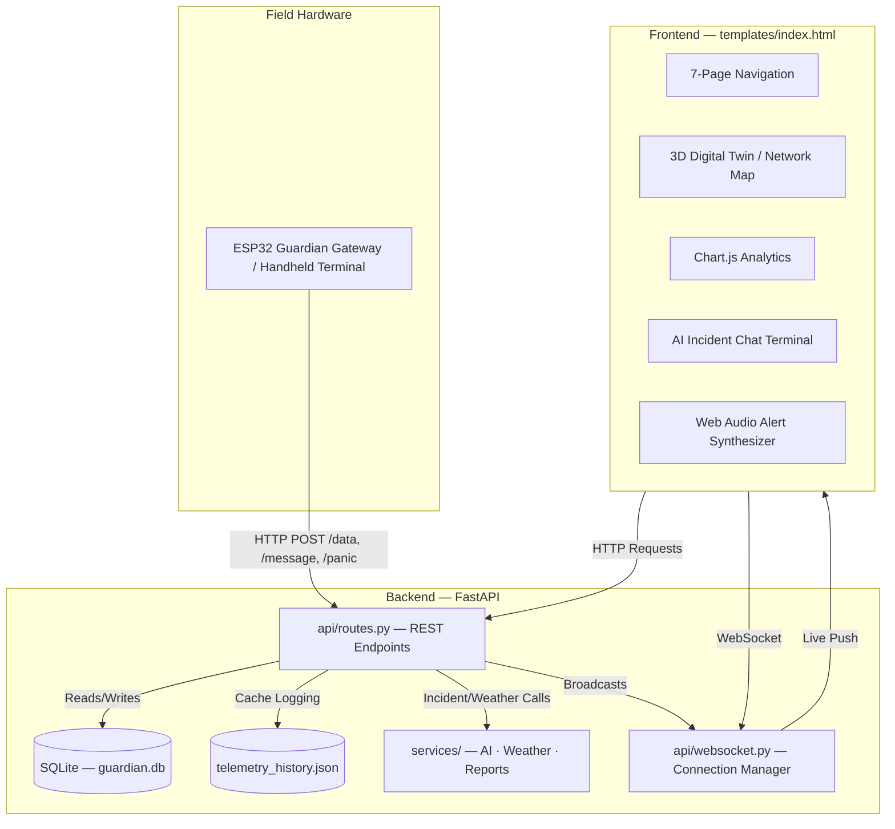

# 🛰️ Guardian Mesh — Environmental Intelligence & Disaster Monitoring Platform

> **A low-cost, offline-resilient environmental monitoring ground station for remote sensor mesh networks — with real-time telemetry, AI-powered incident analysis, and a full disaster-simulation toolkit.**

[](.github/workflows/ci.yml)
[](https://www.python.org/)
[](https://fastapi.tiangolo.com/)
[](gurdian_gateway_v1/)
[](#license)

---

## Table of Contents

- [What Is Guardian Mesh?](#what-is-guardian-mesh)
- [Why It's Useful](#why-its-useful)
- [Architecture Overview](#architecture-overview)
- [7-Page Dashboard Tour](#7-page-dashboard-tour)
- [Database Schema](#database-schema)
- [Getting Started](#getting-started)
  - [Prerequisites](#prerequisites)
  - [Installation](#installation)
  - [Configuration](#configuration)
  - [Running the Server](#running-the-server)
  - [Verifying It Works](#verifying-it-works)
- [Usage Examples](#usage-examples)
  - [Sending Telemetry from a Node](#sending-telemetry-from-a-node)
  - [Triggering a Panic Alert](#triggering-a-panic-alert)
  - [Running the One-Click Fire Demo](#running-the-one-click-fire-demo)
  - [Subscribing to Live Updates via WebSocket](#subscribing-to-live-updates-via-websocket)
  - [Requesting an AI Incident Report](#requesting-an-ai-incident-report)
- [API Reference (Summary)](#api-reference-summary)
- [Hardware: ESP32 Gateway & Handheld Terminal](#hardware-esp32-gateway--handheld-terminal)
- [Project Structure](#project-structure)
- [Configuration Reference](#configuration-reference)
- [Testing](#testing)
- [Continuous Integration](#continuous-integration)
- [Deployment](#deployment)
- [Offline-First Design Philosophy](#offline-first-design-philosophy)
- [Roadmap Ideas](#roadmap-ideas)
- [Where to Get Help](#where-to-get-help)
- [Who Maintains This](#who-maintains-this)
- [Contributing](#contributing)
- [License](#license)

---

## What Is Guardian Mesh?

**Guardian Mesh** is a full-stack environmental and disaster-monitoring platform designed for **remote, low-connectivity areas** such as forests, rural settlements, or disaster-response zones. It combines:

- A **Python (FastAPI) backend** that ingests telemetry from distributed sensor nodes, persists it to SQLite, and broadcasts live updates over WebSockets.
- A **7-page web dashboard** ("Guardian Mesh OS") with 3D network visualizations, real-time telemetry grids, analytics charts, an AI scenario/incident console, and a CSV data exporter.
- **ESP32 firmware** (`gurdian_gateway_v1/`) for a battery-powered handheld terminal that can send free-text alerts and status messages to the ground station over Wi-Fi — useful when a full sensor node isn't available but a human still needs to report in.
- An **AI incident-analysis layer** that turns raw sensor anomalies into structured, human-readable incident briefs (probable cause, severity, confidence score, recommended action) using Gemini or Claude, with an offline mock fallback so the system keeps working with zero internet access.

The project was originally built as a wildfire/environmental early-warning system for hackathon demonstration, but its data model (temperature, humidity, pressure, air quality, rainfall, wind speed, battery, signal strength, relay path) generalizes to almost any distributed IoT sensor deployment.

---

## Why It's Useful

- 🔌 **Offline-first, by design.** Every external integration — AI analysis, weather, air quality, fire-hotspot data — has a fully-functional **local fallback**. The dashboard, database, alerting, and simulations all work with zero API keys and zero internet connection. External APIs are treated strictly as *optional enhancements*.
- 📡 **Built for lossy, intermittent networks.** The backend implements **store-and-forward caching**: when the "ground station" link is simulated as offline, incoming packets are queued instead of dropped and automatically reconciled once the link is restored.
- 🧠 **AI-assisted triage without vendor lock-in.** The AI service tries **Gemini → Claude → local mock**, in that order, so a demo or deployment never breaks just because one provider's key is missing or a rate limit is hit.
- 🔥 **One-click disaster simulation.** A built-in "Simulate Forest Fire" trigger and a scripted 5-step demo sequence (`/demo/run`) walk through the entire pipeline — normal telemetry → rising anomaly → fire signature → panic alert → AI incident report — for live demonstrations without needing real hardware in the room.
- 📊 **Real-time by default.** All dashboard clients share one WebSocket channel (`/ws`) and receive instant pushes for sensor updates, panic alerts, packet journeys, AI reports, and node health — no polling required.
- 🧩 **Modular, testable backend.** Routes, database access, and third-party integrations are cleanly separated (`api/`, `database/`, `services/`, `config/`), and a full `pytest` suite exercises the REST surface end-to-end.
- 🖥️ **Hardware-optional.** You can run the entire platform — dashboard, simulations, AI reports, alerts — on a laptop with no sensors attached at all, using the seeded historical data and simulation endpoints. Real ESP32 nodes and the handheld terminal are a drop-in addition once you're ready.

---

## Architecture Overview



**Request flow, end-to-end:**

1. A field node (real ESP32 or a simulated `curl`/script) `POST`s telemetry to `/data`, or a handheld terminal posts a free-text message to `/message`.
2. The backend writes the reading into SQLite (`sensor_data`, `nodes`, `packets`, `events` tables), computes a node health score, and — if the simulated ground-station link is "down" — queues the packet instead (`store-and-forward`).
3. The backend immediately **broadcasts** the update to every connected dashboard over the shared WebSocket channel.
4. If telemetry crosses a configured threshold (see [`config/constants.py`](config/constants.py)), a `panic_alerts` row is created and an audible/visual alarm fires on every connected dashboard.
5. From the dashboard's **AI & Scenario Creator** page, an operator can request an AI-generated incident report (`POST /ai/analyze`), which is generated via Gemini → Claude → offline mock and broadcast to all clients.
6. Operators can acknowledge (`POST /alerts/{id}/ack`) or resolve (`POST /alerts/{id}/resolve`) alerts directly from the dashboard.

---

## 7-Page Dashboard Tour

The primary UI (`templates/index.html`, served at `/`) is a single-page app with client-side navigation across seven sections:

| # | Page | What it shows |
|---|------|----------------|
| 01 | **Introduction** | Project overview, goals, and an auto-rotating 3D network "digital twin" presentation canvas shown on load. |
| 02 | **3D Simulation** | Interactive 3D wireframe of the mesh topology with drag-to-rotate controls. |
| 03 | **Real Data** | Live telemetry grids, the diagnostic event ledger, and packet-journey / store-and-forward status. |
| 04 | **Analytics** | Chart.js visualizations — wave curves, bar charts, stacked line charts, and pie charts over historical telemetry. |
| 05 | **AI & Scenario Creator** | Custom scenario input box and AI incident-analysis terminal; also where the guided demo and forest-fire simulation live. |
| 06 | **CSV Exporter** | Filterable telemetry log viewer with one-click CSV export of the full history. |
| 07 | **Thanks** | Credits / acknowledgements screen. |

A configuration **drawer** (sliding panel, right-aligned) hosts node configuration controls, network-parameter tuning, and the simulation triggers (network online/offline toggle, forest-fire simulation, guided demo).

> **Note:** The repository root also contains a standalone `index.html` — an earlier, single-page cyberpunk-themed version of the dashboard kept for reference. The actively served UI is `templates/index.html`, rendered by the `GET /` route in `main.py`.

---

## Database Schema

Guardian Mesh persists everything locally in SQLite (`guardian.db`, created and migrated automatically on startup by [`database/database.py`](database/database.py)):

| Table | Purpose |
|---|---|
| `sensor_data` | Historical telemetry: temperature, humidity, pressure, AQI, rainfall, wind speed, battery, RSSI, relay path, per node/timestamp. |
| `nodes` | Live inventory of known nodes — last-seen time, battery, RSSI, relay path, firmware version, and a computed health score/status. |
| `node_config` | Per-node settings: sampling rate, transmit interval, enabled sensors, sleep mode. |
| `panic_alerts` | Emergency/critical alert log with lifecycle status (`INCOMING` → `ACKNOWLEDGED` → `RESOLVED`). |
| `events` | Central diagnostic ledger — telemetry receipt, offline queueing, system toggles, panic triggers, handheld messages. |
| `packets` | Packet-journey tracking: hop count, relay path, transmission time, RSSI, delivery status (`DELIVERED` / `PENDING`), used for store-and-forward visualization. |
| `ai_reports` | Stored AI-generated incident briefs. |
| `handheld_messages` | Free-text messages/status reports sent from the ESP32 handheld terminal. |

On first launch, if `sensor_data` is empty, [`database/seed.py`](database/seed.py) populates ~24 hours of realistic historical telemetry and baseline node/config records so the dashboard is never empty on a fresh checkout.

---

## Getting Started

### Prerequisites

- **Python 3.10+** (CI runs against 3.11; the codebase also runs cleanly on 3.14)
- `pip`
- A modern web browser (for the dashboard's 3D canvas and Web Audio alarms)
- *(Optional)* [PlatformIO](https://platformio.org/) + an ESP32 dev board, only if you want to flash the physical handheld gateway firmware

### Installation

```bash
git clone https://github.com/vinaysingh282006/Far_Away.git
cd Far_Away
pip install -r requirements.txt
```

**Dependencies** (from [`requirements.txt`](requirements.txt)): `fastapi`, `uvicorn[standard]`, `aiofiles`, `websockets`, `httpx`, `python-multipart`, `python-dotenv`.

### Configuration

Guardian Mesh runs **fully functional with zero configuration** — every integration below is optional and falls back to realistic mock/local behavior if no key is supplied.

Copy the example environment file and fill in whichever keys you actually have:

```bash
cp .env.example .env
```

```env
# AI
GEMINI_API_KEY=
CLAUDE_API_KEY=

# Weather / Environment
OPENWEATHERMAP_API_KEY=
AQICN_API_KEY=
NASA_FIRMS_API_KEY=

# Security (only needed if you extend auth/sessions)
APP_SECRET_KEY=
JWT_SECRET_KEY=
SESSION_SECRET_KEY=
WEBHOOK_SECRET=

# Cloud / Sync (optional Firebase integration)
FIREBASE_API_KEY=
FIREBASE_AUTH_DOMAIN=
FIREBASE_PROJECT_ID=
FIREBASE_STORAGE_BUCKET=
FIREBASE_MESSAGING_SENDER_ID=
FIREBASE_APP_ID=
FIREBASE_DATABASE_URL=

# Optional / Utility
MAPBOX_API_KEY=
SUPABASE_API_KEY=
SUPABASE_URL=
GITHUB_TOKEN=
```

> ⚠️ **Never commit real API keys.** `.env` is for local development only; in CI/CD or hosted deployments, inject these as GitHub Secrets / your platform's environment variable store. `config/config.py` resolves secrets from environment variables first, then falls back to `config/default_config.json`, and finally to `None` — the frontend never receives raw key values, only boolean "capability" flags (see [Configuration Reference](#configuration-reference)).

### Running the Server

```bash
python main.py
```

or, for auto-reload during development:

```bash
uvicorn main:app --reload --host 127.0.0.1 --port 8000
```

On Windows, you can also double-click / run [`run_local.bat`](run_local.bat), which activates a local virtual environment if present, starts `uvicorn`, and opens your browser automatically.

Then open:

```
http://127.0.0.1:8000/
```

### Verifying It Works

```bash
curl http://127.0.0.1:8000/latest
```

You should get back a structured JSON envelope with the most recent (seeded) telemetry reading, e.g.:

```json
{
  "success": true,
  "message": "Latest telemetry fetched",
  "timestamp": 1755000000,
  "data": {
    "node_id": "NODE_A",
    "temperature": 28.5,
    "humidity": 65.0,
    "pressure": 1012.0,
    "aqi": 55.0,
    "battery": 85,
    "rssi": -62,
    "relay_path": "NODE_B->GROUND"
  }
}
```

---

## Usage Examples

### Sending Telemetry from a Node

Any device (or a simple script) can post telemetry as JSON. Only `node_id` is required — every other field defaults sensibly:

```bash
curl -X POST http://127.0.0.1:8000/data \
  -H "Content-Type: application/json" \
  -d '{
    "node_id": "NODE_A",
    "temperature": 29.4,
    "humidity": 61.0,
    "pressure": 1011.2,
    "aqi": 48.0,
    "rainfall": 0.0,
    "wind_speed": 12.5,
    "battery": 91,
    "rssi": -58,
    "relay_path": "NODE_B->GROUND"
  }'
```

This inserts a `sensor_data` row, updates the `nodes` table with a freshly computed health score, logs an `events` entry, and broadcasts a `sensor_update` + `packet_update` event to every connected dashboard over WebSocket.

### Triggering a Panic Alert

```bash
curl -X POST http://127.0.0.1:8000/panic \
  -H "Content-Type: application/json" \
  -d '{
    "node_id": "NODE_A",
    "message_type": "🆘 NEED ASSISTANCE",
    "relay_path": "NODE_B->GROUND"
  }'
```

Every connected dashboard will immediately show the full-screen alert overlay and play the synthesized alarm.

### Running the One-Click Fire Demo

For live demonstrations, trigger the full 5-step scripted sequence (normal telemetry → rising temperature → fire signature → panic alert → AI incident report) with a single call:

```bash
curl -X POST http://127.0.0.1:8000/demo/run
```

Or trigger just the instantaneous fire-condition injection:

```bash
curl -X POST http://127.0.0.1:8000/simulation/fire
```

You can also flip the simulated ground-station connectivity to exercise the store-and-forward cache:

```bash
curl -X POST http://127.0.0.1:8000/simulation/network-toggle
```

### Subscribing to Live Updates via WebSocket

```javascript
const ws = new WebSocket("ws://127.0.0.1:8000/ws");

ws.onmessage = (event) => {
  const msg = JSON.parse(event.data);
  switch (msg.type) {
    case "sensor_update":
      console.log("New telemetry:", msg.data);
      break;
    case "panic":
      console.warn("ALERT:", msg.data.message_type);
      break;
    case "ai_report":
      console.log("AI incident report:", msg.data);
      break;
    case "packet_update":
    case "queue_update":
    case "network_status_toggle":
    case "alert_state_change":
    case "handheld_message":
      console.log(msg.type, msg);
      break;
  }
};
```

### Requesting an AI Incident Report

```bash
curl -X POST http://127.0.0.1:8000/ai/analyze \
  -H "Content-Type: application/json" \
  -d '{"scenario": "Wildfire detected — temperature 54°C, AQI 285, humidity 18%, NE wind 34 km/h at NODE_A"}'
```

The service tries **Gemini**, then **Claude**, then falls back to a curated **offline mock report** — so this endpoint always returns a usable, structured response (`incident_title`, `severity`, `confidence`, `probable_cause`, `recommended_action`, `related_sensors`) regardless of network access or API key availability.

---

## API Reference (Summary)

All endpoints return a consistent JSON envelope:

```json
// Success
{ "success": true, "message": "...", "timestamp": 1700000000, "data": {...} }

// Error
{ "success": false, "error": "...", "code": 500 }
```

| Method | Endpoint | Description |
|---|---|---|
| `GET` | `/` | Serves the dashboard HTML. |
| `GET` | `/config.json` | Returns safe, public dashboard config (theme, capability flags — never raw keys). |
| `GET` | `/latest` | Most recent telemetry reading. |
| `GET` | `/history?range=1h\|6h\|24h\|7d\|30d` | Historical telemetry for a time window. |
| `GET` | `/history/json` | Full telemetry history (used by the CSV exporter). |
| `POST` | `/data` | Ingest a telemetry reading from a node. |
| `GET` | `/nodes` | List all known nodes with health, battery, RSSI, and config. |
| `POST` | `/panic` | Raise a manual panic/emergency alert. |
| `GET` | `/alerts` | List all panic alerts. |
| `POST` | `/alerts/{id}/ack` | Acknowledge an alert. |
| `POST` | `/alerts/{id}/resolve` | Resolve an alert. |
| `GET` | `/events` | Recent diagnostic event ledger (last 50). |
| `GET` | `/packets` | Recent packet-journey records (last 50). |
| `POST` | `/simulation/fire` | Inject a one-shot wildfire-condition reading + alert. |
| `POST` | `/simulation/network-toggle` | Flip simulated ground-station connectivity (tests store-and-forward). |
| `POST` | `/demo/run` | Run the full guided 5-step demonstration sequence. |
| `POST` | `/ai/analyze` | Generate an AI incident report for a given scenario. |
| `GET` | `/ai/reports` | List stored AI incident reports. |
| `GET` | `/weather?lat=&lon=` | Live weather (OpenWeatherMap) or mock fallback. |
| `GET` | `/aqi?lat=&lon=` | Live air-quality index (AQICN) or mock fallback. |
| `GET` | `/fire-hotspots?lat=&lon=` | Nearby fire hotspots (NASA FIRMS) or mock fallback. |
| `POST` | `/message` | Ingest a free-text message/status from a handheld terminal. |
| `GET` | `/latest_message` | Most recent handheld message. |
| `WS` | `/ws` | Real-time broadcast channel for all dashboard clients. |

For full request/response schemas and field-level detail, see **[docs/API_DOCUMENTATION.md](docs/API_DOCUMENTATION.md)**.

---

## Hardware: ESP32 Gateway & Handheld Terminal

The [`gurdian_gateway_v1/`](gurdian_gateway_v1/) directory contains a [PlatformIO](https://platformio.org/) project for an **ESP32-based handheld field terminal** with an OLED display and physical buttons, designed to send status/emergency messages to the backend over Wi-Fi when full sensor telemetry isn't available.

**Hardware wiring:**

| Component | Pin |
|---|---|
| OLED SDA | GPIO 21 |
| OLED SCL | GPIO 22 |
| OLED VCC | 3.3V |
| OLED GND | GND |
| Button UP | GPIO 14 (other leg → GND) |
| Button DOWN | GPIO 27 (other leg → GND) |
| Button SEND | GPIO 26 (other leg → GND) |

**Network model:** your laptop (running Guardian Mesh) creates a Wi-Fi hotspot; the ESP32 joins it as a client and HTTP-POSTs JSON messages to `/message` on the FastAPI backend, which stores them and broadcasts them to every connected dashboard as a toast/alert.

**Build environment** ([`platformio.ini`](gurdian_gateway_v1/platformio.ini)):

```ini
[env:esp32doit-devkit-v1]
platform = espressif32
board = esp32doit-devkit-v1
framework = arduino
lib_deps =
    nrf24/RF24@^1.6.1
    bblanchon/ArduinoJson@^7.2.2
    links2004/WebSockets@^2.7.3
    adafruit/Adafruit GFX Library@^1.12.6
    adafruit/Adafruit SSD1306@^2.5.17
    mobizt/FirebaseClient@^2.2.9
    mobizt/Firebase Arduino Client Library for ESP8266 and ESP32@^4.4.17
```

To build and flash:

```bash
cd gurdian_gateway_v1
pio run --target upload
pio device monitor
```

The expected outbound JSON payload matches the `/message` endpoint's schema:

```json
{
  "device_id": "HANDHELD_01",
  "message": "Fire Alert",
  "priority": "HIGH",
  "timestamp": 12345678,
  "wifi_rssi": -48,
  "uptime_ms": 12345678
}
```

---

## Project Structure

```
Far_Away/
├── main.py                      # FastAPI entry point (primary backend)
├── main_wifi.py                 # Alternate/local Wi-Fi-focused backend variant
├── requirements.txt             # Python dependencies
├── render.yaml                  # Render.com deployment config
├── run_local.bat                # Windows one-click local launcher
├── .env.example                 # Documented environment variable template
├── config.json                  # Runtime API-key slots exposed to the frontend
├── guardian.db                  # SQLite database (auto-created/seeded)
├── telemetry_history.json       # JSON telemetry cache, synced from SQLite
│
├── config/
│   ├── config.py                 # Secret resolution, logger setup, capability flags
│   ├── constants.py               # Thresholds, health labels, event types
│   └── default_config.json        # Theme + dashboard + API key defaults
│
├── api/
│   ├── routes.py                  # All REST endpoint handlers
│   └── websocket.py                # WebSocket connection manager
│
├── database/
│   ├── database.py                 # SQLite schema, init, migrations, query helper
│   └── seed.py                     # 24h historical telemetry + node seed generator
│
├── services/
│   ├── ai_service.py               # Gemini → Claude → mock incident report generation
│   ├── weather_service.py          # OpenWeatherMap / AQICN / NASA FIRMS + mock fallbacks
│   └── report_service.py           # CSV/PDF telemetry export helpers
│
├── static/
│   ├── css/styles.css               # Dashboard styling (corporate maroon/black theme)
│   └── js/app.js                    # All frontend logic (WebSocket client, charts, etc.)
│
├── templates/
│   └── index.html                   # Actively served 7-page dashboard
├── index.html                       # Legacy single-page cyberpunk-themed dashboard
│
├── gurdian_gateway_v1/               # ESP32 handheld terminal firmware (PlatformIO)
│   ├── platformio.ini
│   └── src/main.cpp
│
├── docs/
│   ├── README.md                     # Extended project documentation
│   ├── API_DOCUMENTATION.md          # Full endpoint reference
│   ├── ARCHITECTURE.md               # (reserved for deeper architecture notes)
│   ├── DEPLOYMENT.md                 # (reserved for deployment notes)
│   ├── HARDWARE_SETUP.md             # (reserved for hardware setup notes)
│   └── SOFTWARE_SETUP.md             # (reserved for software setup notes)
│
├── tests/
│   └── test_backend.py               # Pytest suite covering the full REST surface
│
├── logs/
│   └── system.log                    # Runtime application log
│
└── .github/workflows/ci.yml          # GitHub Actions CI (lint, tests, structure checks)
```

---

## Configuration Reference

Configuration is layered, in order of precedence:

1. **Environment variables** (`.env` locally, or GitHub Secrets / host platform env vars in deployment)
2. **`config/default_config.json`** (`api_keys.*`, `theme.*`, `dashboard.*`)
3. Safe hard-coded defaults

`config/config.py` exposes:

- Individual resolved secrets (`GEMINI_API_KEY`, `CLAUDE_API_KEY`, `OPENWEATHERMAP_API_KEY`, `AQICN_API_KEY`, `NASA_FIRMS_API_KEY`, Firebase keys, security keys, etc.)
- A single `get_config()` function returning **`DASHBOARD_CONFIG`** — the only object ever sent to the browser via `GET /config.json`. It contains:
  - `theme`: accent color, background color, animation speed, blur intensity, card opacity
  - `dashboard`: sampling interval, demo mode flag
  - `capabilities`: **boolean-only** flags (`ai_gemini`, `ai_claude`, `weather`, `aqi`, `nasa_firms`, `firebase`, `mapbox`) indicating which integrations are active — **raw API keys are never exposed to the frontend.**

Alert thresholds and other tunables live in [`config/constants.py`](config/constants.py), e.g.:

```python
TEMP_ALERT          = 40.0    # °C
AQI_HAZARDOUS        = 200.0
AQI_ALERT             = 150.0
RAINFALL_ALERT        = 50.0  # mm/h
WIND_ALERT            = 60.0  # km/h
PRESSURE_DROP_ALERT   = 5.0   # hPa / 30 min
BATTERY_WARNING       = 20    # %
RSSI_WEAK             = -80   # dBm
```

---

## Testing

The project ships a comprehensive `pytest` suite (`tests/test_backend.py`) covering the homepage, static file serving, config loading, telemetry ingestion, history queries, node listings, panic-alert lifecycle, packet tracking, event logging, simulations, response-envelope consistency, database integrity, CSV export data shape, and handheld message ingestion.

```bash
pip install pytest httpx pytest-cov
pytest tests/ -v --cov=. --cov-report=term-missing
```

---

## Continuous Integration

Every push/PR to `main` or `dev` runs via [`.github/workflows/ci.yml`](.github/workflows/ci.yml):

- **Code Quality & Tests** — installs dependencies, checks formatting with `black`, import order with `isort`, lints with `flake8`, and runs the full `pytest` suite with coverage (uploaded to Codecov).
- **Project Structure Check** — verifies that all required backend files exist and scans `templates/` and `static/` for accidentally hardcoded API keys (`sk-ant-...`, `AIza...`), failing the build if any are found.

---

## Deployment

A ready-to-use [`render.yaml`](render.yaml) is included for deploying to [Render](https://render.com/):

```yaml
services:
  - type: web
    name: guardian-mesh
    env: python
    buildCommand: pip install -r requirements.txt
    startCommand: uvicorn main:app --host 0.0.0.0 --port $PORT
    envVars:
      - key: PYTHON_VERSION
        value: 3.10.0
```

Simply connect the repository in Render, set any of the optional API keys from `.env.example` as environment variables in the Render dashboard, and deploy. Because every integration has an offline fallback, the app will run correctly even if you deploy with **no keys configured at all**.

---

## Offline-First Design Philosophy

Guardian Mesh is built on the assumption that it will often run in places with **no reliable internet connection** — that's the whole point of a disaster/environmental monitoring ground station. As a result:

- The **AI incident report generator** tries Gemini, then Claude, then falls back to a set of realistic, pre-written incident reports so demos and real deployments never show a broken feature.
- **Weather, AQI, and fire-hotspot data** each have local mock generators that produce plausible, time-varying values when no API key is configured or the network call fails.
- **Store-and-forward packet caching** means the simulated ground-station link can be toggled offline without losing any incoming telemetry — packets queue in the `packets` table and are visualized as `PENDING` until the link is restored.
- The **SQLite database and `telemetry_history.json` cache** mean the dashboard remains fully populated and interactive even with the server started completely disconnected from any network.

---

## Roadmap Ideas

The following areas are not fully implemented yet but are natural next steps based on the current structure:

- Flesh out the currently-empty `docs/ARCHITECTURE.md`, `docs/DEPLOYMENT.md`, `docs/HARDWARE_SETUP.md`, and `docs/SOFTWARE_SETUP.md` files.
- Wire up `services/report_service.py`'s CSV/PDF export helpers to a dedicated `/reports/export` endpoint.
- Real mesh-relay support beyond the simulated `relay_path` string (e.g. an actual RF24-based multi-hop protocol, since `RF24` is already a firmware dependency).
- Authentication for the dashboard/API using the already-provisioned `JWT_SECRET_KEY` / `SESSION_SECRET_KEY` values.
- Optional Firebase Cloud sync (config slots already exist in `.env.example` and `config/config.py`).

---

## Where to Get Help

- **Bugs & feature requests:** please open an issue in the project's GitHub Issues tab.
- **API details:** see [docs/API_DOCUMENTATION.md](docs/API_DOCUMENTATION.md) for full request/response schemas.
- **Extended docs:** see [docs/README.md](docs/README.md) for an additional documentation entry point.
- **Hardware questions:** wiring and firmware notes live in [`gurdian_gateway_v1/src/main.cpp`](gurdian_gateway_v1/src/main.cpp)'s header comment block; a dedicated `docs/HARDWARE_SETUP.md` is reserved for expanded instructions.

---

## Who Maintains This

Guardian Mesh is maintained by **[Vinay Singh](https://github.com/vinaysingh282006)** ([@vinaysingh282006](https://github.com/vinaysingh282006)).

## Contributing

Contributions, bug reports, and feature suggestions are welcome. Please open an issue to discuss significant changes before submitting a pull request. See `CONTRIBUTING.md` (if present) for detailed guidelines, or open a PR directly for smaller fixes.

## License

This project is intended to be released under the **MIT License** for education, disaster response, and environmental monitoring use cases. See the `LICENSE` file for the full license text. *(If no `LICENSE` file is present yet in this repository, add one before distributing or accepting external contributions.)*
